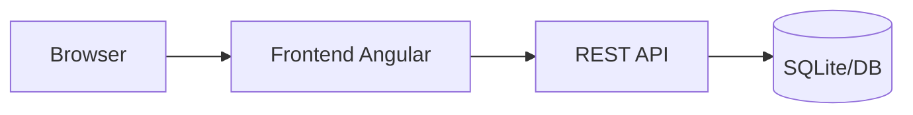

# LK02 — Deploy Aplikasi Rentan & Recon Awal

> **Minggu 2 · Sub-CPMK-2, Sub-CPMK-3 · Bobot 2% · Durasi 2×50 menit (2 SKS kelas hands-on; dilanjutkan mandiri) · Individu**

## Tujuan

Menjalankan aplikasi rentan (OWASP Juice Shop) via `docker-compose`, lalu melakukan reconnaissance
awal dan memetakan **attack surface**.

## Langkah

### 1) Buat `docker-compose.yml`

Di root repo:

```yaml
services:
  juice-shop:
    image: bkimminich/juice-shop
    container_name: juice-shop
    ports:
      - "3000:3000"
    restart: unless-stopped
```

Jalankan:

```bash
docker compose up -d
docker compose ps
# buka http://localhost:3000
```

### 2) Recon: identifikasi teknologi

```bash
# header & teknologi
curl -sI http://localhost:3000 | tee labs/LK02-recon/headers.txt
```

Perhatikan header keamanan yang **hilang** (mis. `Content-Security-Policy`, `X-Frame-Options`,
`Strict-Transport-Security`). Catat.

### 3) Petakan endpoint & permukaan serang

Telusuri aplikasi lewat browser (DevTools → Network) dan catat:

- Halaman & fitur (login, register, search, keranjang, feedback, upload).
- Endpoint API (mis. `/rest/user/login`, `/api/Products`, `/rest/products/search`).
- Parameter input & titik yang menerima data pengguna.
- Peran/otentikasi (user biasa vs admin).

### 4) Buat tabel attack surface

Buat `labs/LK02-recon/attack-surface.md`:

| Entry point             | Metode/Param        | Aset terkait    | Dugaan risiko (OWASP)   |
| ----------------------- | ------------------- | --------------- | ----------------------- |
| `/rest/user/login`      | POST email,password | kredensial/sesi | A03 Injection, A07 Auth |
| `/rest/products/search` | GET `q`             | data produk     | A03 Injection/XSS       |
| `/profile` upload       | POST file           | penyimpanan     | A05/A08                 |
| …                       | …                   | …               | …                       |

### 5) Diagram alur sederhana

Tambahkan diagram trust boundary (Browser → API → DB) di `attack-surface.md`
(boleh Mermaid):

````markdown

````

### 6) Commit & push

```bash
git add docker-compose.yml labs/LK02-recon
git commit -m "LK02: deploy juice-shop + recon & attack surface"
git push
```

## Luaran

- `docker-compose.yml` yang menjalankan aplikasi.
- `labs/LK02-recon/`: `headers.txt`, `attack-surface.md` (tabel + diagram).

## Kriteria penilaian

| Aspek                               | Bobot |
| ----------------------------------- | ----- |
| Aplikasi berjalan via Compose       | 30%   |
| Kelengkapan pemetaan attack surface | 40%   |
| Kualitas dokumentasi & diagram      | 30%   |

## Checklist submit

- [ ] `docker compose up -d` → app dapat diakses
- [ ] Header keamanan yang hilang tercatat
- [ ] ≥ 8 entry point dipetakan + dugaan OWASP
- [ ] Diagram trust boundary dibuat
