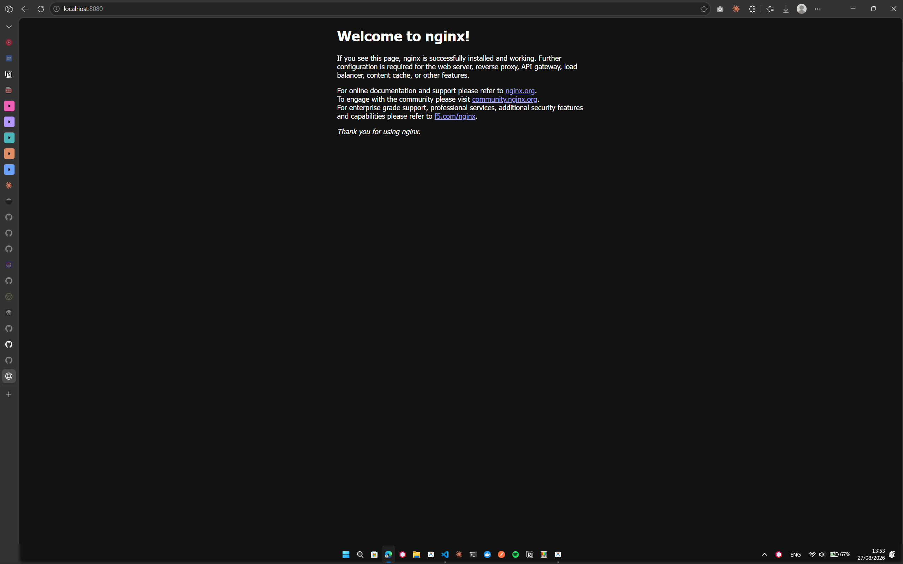
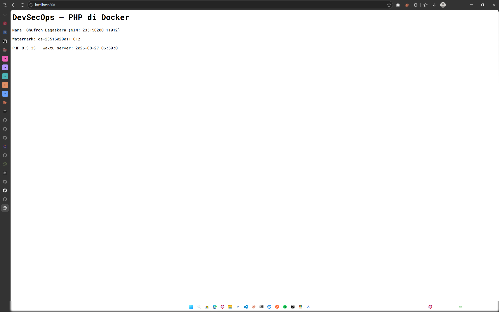

# LK01 — Setup Toolchain: Docker & GitHub

- Nama / NIM  : Ghufron Bagaskara (235150200111012)
- Watermark   : ds-235150200111012
- Minggu      : 1
- OWASP       : Primary A03 · Secondary A02

---

## Langkah yang dilakukan

### B — Instalasi Docker
Docker Desktop dipasang di Windows dengan WSL2 aktif. Verifikasi lewat terminal:
```bash
docker --version        # Docker Engine 28.4.0 (build d8eb465)
docker compose version  # Docker Compose v2.39.4-desktop.1
docker run --rm hello-world
```
Pesan "Hello from Docker!" muncul di terminal, instalasi berhasil.

### C — Container pertama (nginx)
```bash
docker run --rm -d -p 8080:80 --name web nginx
curl -I http://localhost:8080   # 200 OK
docker stop web
```
Port 8080 di laptop dipetakan ke port 80 di dalam container nginx.
Browser dibuka ke `http://localhost:8080` dan halaman default nginx muncul.

### D1 — Kode PHP mode CLI
```bash
# Masuk ke folder php-demo
docker run --rm -v "${PWD}:/app" -w /app php:8.3-cli php hello.php
```
Output muncul di terminal termasuk watermark `ds-235150200111012`.
PHP dijalankan sepenuhnya di dalam container, tidak ada PHP yang terpasang di laptop.

### D2 — Kode PHP mode web
```bash
docker run --rm -d -p 8081:80 -v "${PWD}:/var/www/html" --name php-web php:8.3-apache
```
Halaman `http://localhost:8081` menampilkan nama, NIM, watermark, dan timestamp server PHP.

### E — Konfigurasi Git & repositori
```bash
git config --global user.name "Ghufron Bagaskara"
git config --global user.email "235150200111012@student.ub.ac.id"
git --version   # git version 2.45.2.windows.1
```
Repo `devsecops-235150200111012` di organisasi `Devsecops-Filkom-2026` berhasil di-clone.
`project/IDENTITY.md` sudah diisi sesuai formula NIM (d2=12 → Primary A03, Secondary A02).

---

## Hasil & bukti

| Bukti | File |
|---|---|
| Container nginx jalan di browser | `bukti/bukti-nginx.png` |
| Halaman PHP dengan watermark di browser | `bukti/bukti-php.png` |




- Output/berkas: `php-demo/hello.php`, `php-demo/index.php`
- Pemetaan OWASP: A03 (Injection) — pemahaman isolasi container mencegah eksekusi kode berbahaya langsung di host

---

## Refleksi (150–300 kata)

Dua digit terakhir NIM saya 12, sehingga Primary OWASP A03 dan Secondary A02. Pembagian fokus ini masuk akal karena kalau semua orang memakai langkah yang sama dan menghasilkan file identik, perbedaan fokus OWASP itulah yang membuat analisis tiap orang tidak bisa dipertukarkan.

Bagian yang paling perlu perhatian di LK ini adalah volume mount Docker di Windows PowerShell. Sintaks `"$PWD":/app` tidak selalu berjalan lurus; saya perlu menulis `"${PWD}:/app"` agar path terdeteksi benar. Ini bukan bug, melainkan perbedaan cara PowerShell mengekspansi variabel dibanding Bash di Linux. Setelah paham pola ini, perintah langsung berjalan.

Konsep yang paling membantu dipahami lewat praktik langsung adalah port mapping. Membaca `-p 8081:80` di dokumentasi terasa abstrak sampai saya buka browser, ketik `localhost:8081`, dan halaman PHP muncul. Container menjalankan Apache di port 80 internal; laptop mengaksesnya lewat 8081. Tidak ada instalasi Apache atau PHP di mesin host sama sekali.

Untuk image `php:8.3-apache`, dokumen root default container ada di `/var/www/html`. Volume mount mengarahkan folder lokal ke sana, sehingga perubahan pada `index.php` langsung terlihat tanpa restart container. Ini yang membuat setup seperti ini nyaman untuk development.

Watermark `ds-235150200111012` sudah disertakan di `hello.php`, `index.php`, dan terlihat di halaman browser saat screenshot diambil.

---

## Checklist submit
- [x] `docker run hello-world` berhasil
- [x] Container nginx jalan + `bukti/bukti-nginx.png`
- [x] `hello.php` berjalan via `php:8.3-cli`
- [x] `index.php` tampil di browser via `php:8.3-apache` + `bukti/bukti-php.png` (memuat watermark)
- [x] Repo `devsecops-235150200111012` bisa diakses & `IDENTITY.md` terisi
- [x] `git push` berhasil

---

*Dikerjakan oleh Ghufron Bagaskara (235150200111012) — WM ds-235150200111012*
