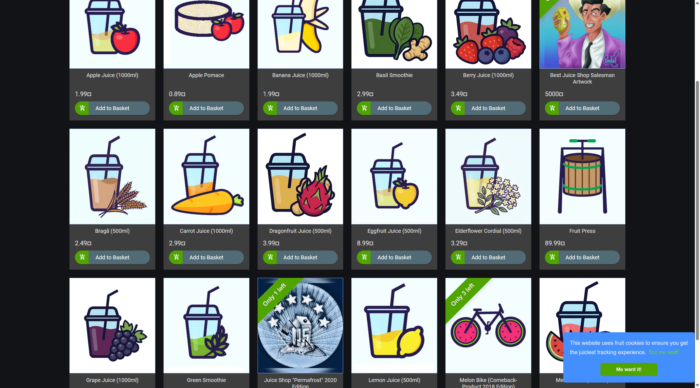
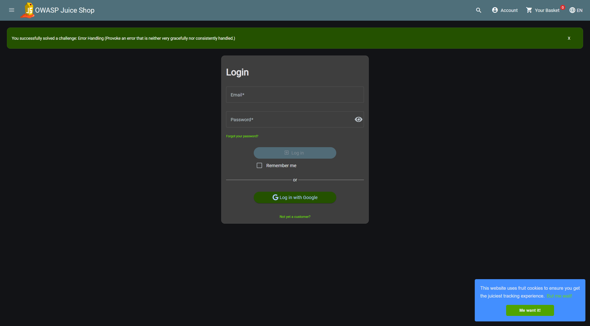

# LK02 — Deploy Aplikasi Rentan & Recon Awal

- Nama / NIM  : Ghufron Bagaskara (235150200111012)
- Watermark   : ds-235150200111012
- Minggu      : 2
- OWASP       : Primary A03 · Secondary A02

---

## Langkah yang dilakukan

### 1 — Deploy Juice Shop via Docker Compose

`docker-compose.yml` sudah tersedia di root repo. Menjalankan aplikasi:

```bash
docker compose up -d
docker compose ps
```

Output `docker compose ps`:
```
NAME         IMAGE                   COMMAND               SERVICE      STATUS
juice-shop   bkimminich/juice-shop   "/nodejs/bin/node …"  juice-shop   Up (running)   0.0.0.0:3000->3000/tcp
```

Aplikasi berjalan di `http://localhost:3000`.

### 2 — Recon: Capture Header HTTP

```bash
curl -sI http://localhost:3000 | tee labs/LK02-recon/headers.txt
```

Output tersimpan di [`headers.txt`](headers.txt). Header keamanan yang **hilang** dicatat di `attack-surface.md`.

### 3 — Petakan Endpoint & Attack Surface

Telusuri aplikasi lewat browser (DevTools → Network tab) dan catat semua endpoint:
- Halaman: login, register, search, keranjang, feedback, profile/upload
- Endpoint API: `/rest/*` dan `/api/*`
- Parameter input yang menerima data pengguna
- Respons tanpa auth (endpoint terbuka)

### 4 — Tabel Attack Surface & Diagram

Hasil pemetaan ≥ 12 entry point tersimpan di [`attack-surface.md`](attack-surface.md) lengkap dengan:
- Kolom metode/parameter, aset terkait, dan dugaan risiko OWASP
- Analisis header keamanan yang hilang
- Diagram trust boundary (Mermaid)

---

## Hasil & Bukti

| Bukti | File |
|---|---|
| Juice Shop berjalan di `http://localhost:3000` | `bukti/bukti-juiceshop-running.png` |
| Halaman Login Juice Shop | `bukti/bukti-login-page.png` |
| Header HTTP raw output | `headers.txt` |
| Tabel attack surface & diagram | `attack-surface.md` |





- Pemetaan OWASP: **A03** Injection (search endpoint), **A07** Auth Failure (login), **A01** IDOR (basket/user), **A05** Security Misconfiguration (missing headers)

---

## Refleksi (150–300 kata)

LK02 memberikan gambaran nyata tentang apa yang dimaksud dengan "attack surface" — bukan sekadar teori, tapi benar-benar menelusuri endpoint satu per satu dan bertanya: *siapa yang bisa mengaksesnya, dengan data apa, dan apa yang bisa salah?*

Yang menarik adalah betapa mudahnya menemukan masalah hanya dengan `curl -sI`. Tanpa login sama sekali, sudah terlihat bahwa `Content-Security-Policy` dan `Strict-Transport-Security` tidak ada. Ini langsung masuk OWASP A05 Security Misconfiguration — bukan karena ada serangan, tapi karena konfigurasi defaultnya sudah tidak aman.

Untuk fokus saya di **A03 Injection**: endpoint `/rest/products/search?q=` sangat menonjol. Parameter `q` dikirim langsung lewat query string ke backend yang (berdasarkan literatur Juice Shop) tidak di-sanitasi sebelum masuk ke query SQLite. Ini adalah titik masuk klasik SQL injection. Di LK06 nanti, inilah yang akan dieksploitasi.

Diagram trust boundary membantu saya memvisualisasikan alur data: dari browser ke Angular SPA, lalu ke REST API Express, lalu ke SQLite. Setiap panah adalah titik potensial serangan. Yang paling berbahaya adalah ketika data dari browser langsung masuk ke query DB tanpa validasi di lapisan API.

Kesimpulan recon ini: Juice Shop memang dirancang rentan, dan dari sekadar melihat header + endpoint publik, sudah ada >10 titik risiko yang teridentifikasi bahkan sebelum login.

Watermark `ds-235150200111012` sudah disertakan di semua file output.

---

## Checklist Submit
- [x] `docker compose up -d` → app dapat diakses di `http://localhost:3000`
- [x] Header keamanan yang hilang tercatat (`headers.txt` + analisis di `attack-surface.md`)
- [x] ≥ 8 entry point dipetakan + dugaan OWASP (total 12 entry point)
- [x] Diagram trust boundary dibuat (Mermaid di `attack-surface.md`)
- [x] Bukti screenshot tersimpan di `bukti/`

---

*Dikerjakan oleh Ghufron Bagaskara (235150200111012) — WM ds-235150200111012*
