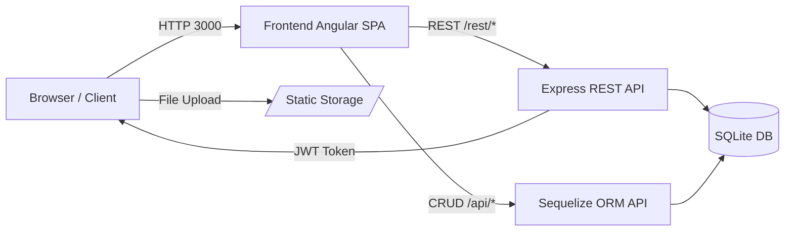

# Attack Surface — OWASP Juice Shop
*Watermark: ds-235150200111012 — Ghufron Bagaskara (235150200111012)*

## Diagram Trust Boundary

---

## Tabel Attack Surface

| # | Entry Point | Metode / Parameter | Aset Terkait | Dugaan Risiko (OWASP) |
|---|---|---|---|---|
| 1 | `/rest/user/login` | POST `email`, `password` | Kredensial, sesi JWT | **A03** SQL Injection, **A07** Auth Failure |
| 2 | `/rest/products/search` | GET `?q=<keyword>` | Data produk, DB | **A03** SQLi / XSS via parameter q |
| 3 | `/api/Users` | POST `email`, `password`, `role` | Data pengguna | **A01** Broken Access Control (role injection) |
| 4 | `/api/Users/:id` | GET/PUT tanpa validasi ID | Data pengguna lain | **A01** IDOR (Insecure Direct Object Reference) |
| 5 | `/rest/user/whoami` | GET (tanpa auth → 200) | Sesi login aktif | **A07** Auth: endpoint terbuka |
| 6 | `/rest/basket/:id` | GET (butuh JWT) | Data keranjang user lain | **A01** IDOR — 401 tanpa token, cek bypass |
| 7 | `/api/Feedbacks` | POST `comment`, `rating` | Konten feedback publik | **A03** XSS stored via kolom comment |
| 8 | `/rest/user/reset-password` | POST `email`, `answer` | Akun pengguna | **A07** Weak security question recovery |
| 9 | `/profile` (upload avatar) | POST multipart file | File system container | **A05** Security Misconfiguration, unrestricted upload |
| 10 | `/#/register` | POST email, password, security Q | Akun baru | **A02** Cryptographic Failure (password hash lemah?) |
| 11 | `/rest/admin/application-configuration` | GET (tanpa auth check) | Konfigurasi app | **A01** Broken Access Control — data sensitif terbuka |
| 12 | `/rest/chatbot/respond` | POST `query` | Data internal / log | **A03** Prompt injection / info disclosure |

---

## Analisis Header Keamanan

Header yang **ADA** (dari `curl -sI http://localhost:3000`):

| Header | Nilai | Keterangan |
|---|---|---|
| `X-Content-Type-Options` | `nosniff` | ✅ Ada |
| `X-Frame-Options` | `SAMEORIGIN` | ✅ Ada (mencegah clickjacking) |
| `Feature-Policy` | `payment 'self'` | ✅ Ada (terbatas) |
| `Access-Control-Allow-Origin` | `*` | ⚠️ Terlalu permisif (semua origin) |

Header **HILANG** yang seharusnya ada:

| Header | Risiko Tanpa Header |
|---|---|
| `Content-Security-Policy` | ❌ TIDAK ADA → rentan XSS, injeksi skrip |
| `Strict-Transport-Security` | ❌ TIDAK ADA → tidak memaksa HTTPS |
| `Referrer-Policy` | ❌ TIDAK ADA → bocor URL ke pihak ketiga |
| `Permissions-Policy` | ❌ TIDAK ADA → akses kamera/mic tidak dibatasi |
| `X-XSS-Protection` | ❌ TIDAK ADA → tidak ada perlindungan XSS browser lama |

**OWASP Mapping**: A05 — Security Misconfiguration (header keamanan tidak dikonfigurasi).

---

## Teknologi yang Teridentifikasi

- **Frontend**: Angular SPA (single-page app, routing `/#/`)
- **Backend**: Node.js + Express.js
- **Database**: SQLite (terlihat dari error response saat SQL injection)
- **Auth**: JWT (JSON Web Token) — terlihat dari response header dan endpoint `/rest/user/login`
- **Port**: 3000 (HTTP, tidak ada HTTPS di mode dev)
- **Image Docker**: `bkimminich/juice-shop` (versi latest)

*Watermark: ds-235150200111012 — Ghufron Bagaskara (235150200111012)*
